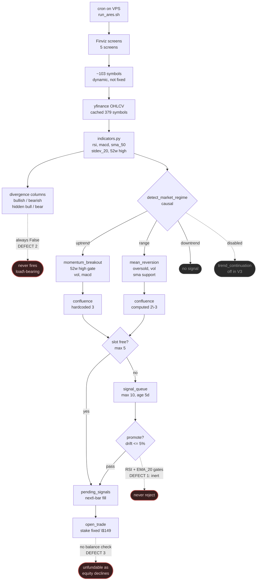
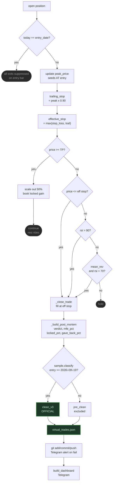
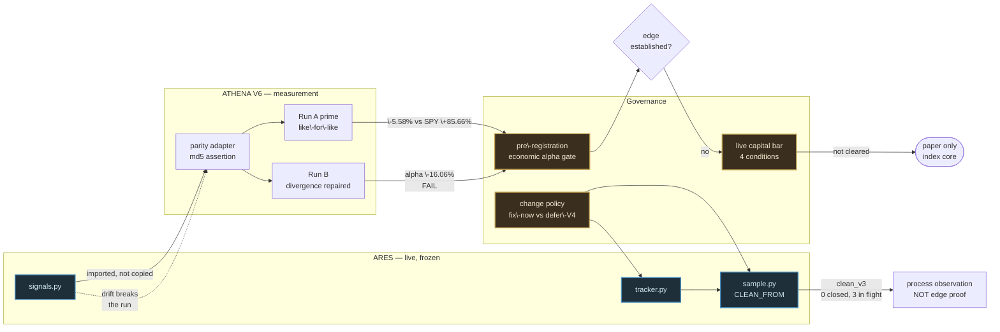

# ARES — System Overview

*Generated 2026-09-24. Reflects V3.1 as deployed, after the Sep 22 audit sequence.*

---

## 1. Daily pipeline — screen to fill

---

## 2. Position lifecycle — fill to measurement

**The trail dead band.** Because `peak` seeds at entry and the trail sits 10% below it,
a trailing exit cannot clear breakeven until the trade has gained more than **\+11.1%**:

| Peak vs entry | Label | Outcome |
|---|---|---|
| \< \+6.7% | `stop_loss` | loss — trail still under the initial stop |
| **\+6.7% to \+11.1%** | **`trailing_stop`** | **still a loss** — ECO, peak \+8.97% |
| \> \+11.1% | `trailing_stop` | first point profit can lock — HAFN, peak \+15.53% |

---

## 3. The evidence layer — what makes a number trustworthy

---

## 4. Where it stands

| Layer | State |
|---|---|
| **Strategy** | Frozen at V3.1. Parameters byte\-identical to V3.0 |
| **Research question** | **Closed.** Momentum works as a factor; this implementation subtracts from it |
| `clean_v3` | **0 closed, 3 in flight** (TMO, WBD, NEOG). Demoted to process observation |
| **Athena V1\-V5** | Retracted — look\-ahead bias, ~96% of profit came from future\-dated exits |
| **Athena V6** | Trustworthy. Imports live code under checksum assertion |
| **Live capital** | Behind a written 4\-condition bar. June 2027 is a review gate, not a deploy date |

### Defect ledger

| # | Defect | Status |
|---|---|---|
| 1 | Queue gates read `RSI` / `EMA_20`; indicators emit `rsi`, no `EMA_20` | Documented, **unrepaired** |
| 2 | Divergence columns permanently `False` | Documented, **unrepaired** — Run B proved repair makes it worse |
| 3 | Constant sizing, no balance check | **To fix** — only one with a real deadline |
| 4 | Post\-mortem read `rsi_extreme`, producer emits `emotional_extreme` | **Fixed** Sep 24 |

Four instances of one class: **a string written in one place and read in another, with
nothing asserting they match.**

### What has never happened

| | |
|---|---|
| A `clean_v3` trade closing | 0 of 40 target |
| `momentum_breakout` reaching TP | 0 of 2. HAFN's \+15.53% is the closest to \+18% |
| An exit other than stop, trail, or scale\-out | 0 |
